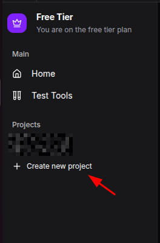
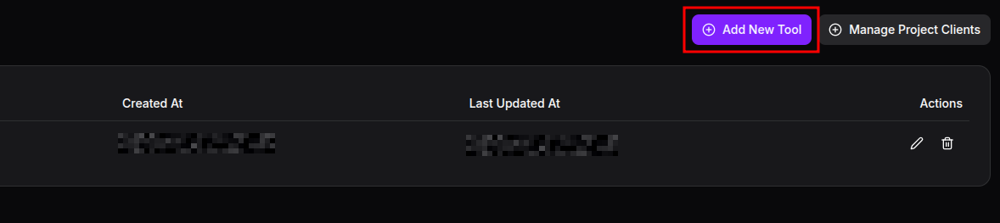
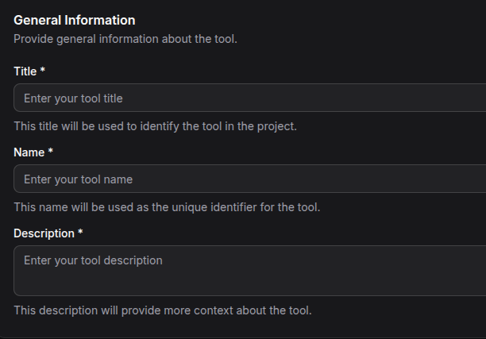
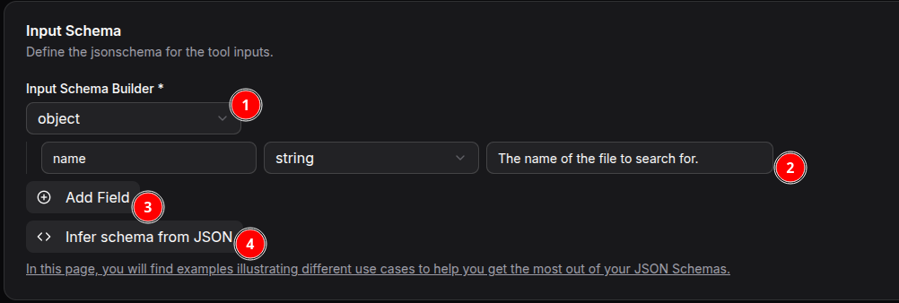

# Creating Your First Tool

Tools are the core functionality of your MCP server—they define what actions AI models can perform using your integrated data sources and APIs.

## What are Tools?

Tools are interactive functions that AI models can invoke to perform specific actions. They can:
- Query databases for information
- Make API calls to external services
- Process and transform data
- Execute business logic workflows

## Creating Your First Tool

### Step 1: Create Your First Server Project (if not already completed)

1. Open your MCP Express dashboard
2. Click the "Create new project" button
3. Complete the required information to create your new MCP Server

*The sidebar showing a button to create a new MCP Server Project*

### Step 2: Create Your First Tool
1. Open the newly created MCP Server Project
2. Click the "Add New Tool" button to get started

*The tools management interface showing existing tools and the create button*

### Step 3: Select Integration

Choose the integration your tool will use. Select from our pre-existing integrations or create your own by writing custom code.

### Step 4: Configure Basic Settings

Fill in the basic information for your tool:

- **Title**: A clear, descriptive name for human readers (e.g., "Get Customer Info")
- **Tool Name**: A unique identifier for the tool used by machines (e.g., "get_customer_info")
- **Description**: Explanation of what the tool does and when to use it

*Basic tool configuration form with name, description, and category fields*

### Step 5: Define Input Parameters

Input parameters define the necessary fields required to use the tool. For example, to look up weather information, you might need the city name.

*Parameter configuration interface showing different parameter types and settings*

1. **Object/Array**: The input type, which can be an array or an object. For simple usage, always use object.
2. **Field Information**: The input field name and type. Note that adding a clear description helps the LLM determine the correct values to use.
3. **New Fields**: You can define multiple fields as needed for your tool.
4. **Infer from JSON**: For complex JSON inputs, you can infer the schema from existing JSON data.

### Step 6: Configure Action

Define the action the tool performs. An example configuration using the [REST API](/integrations/rest-api) integration is shown below:

*Action configuration showing REST API Connection with parameter placeholders*
