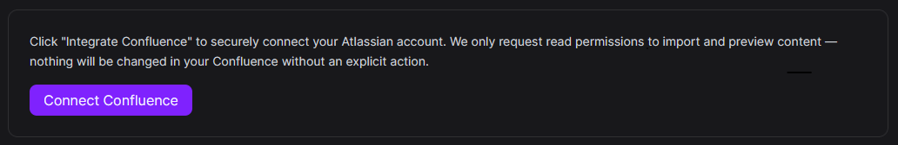
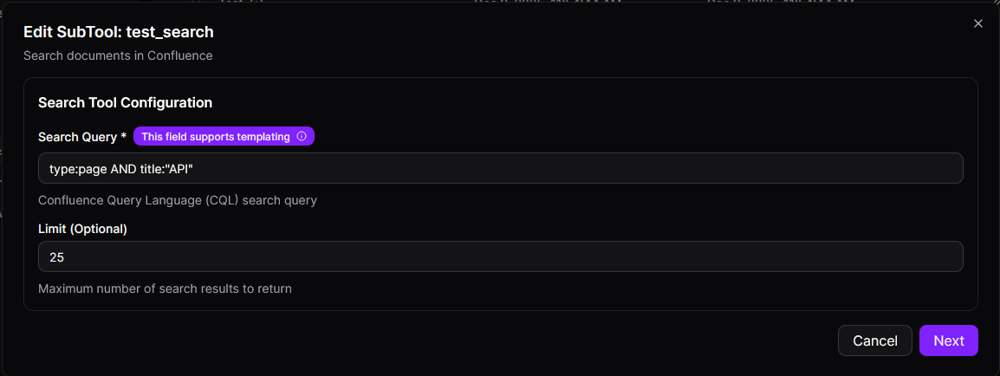
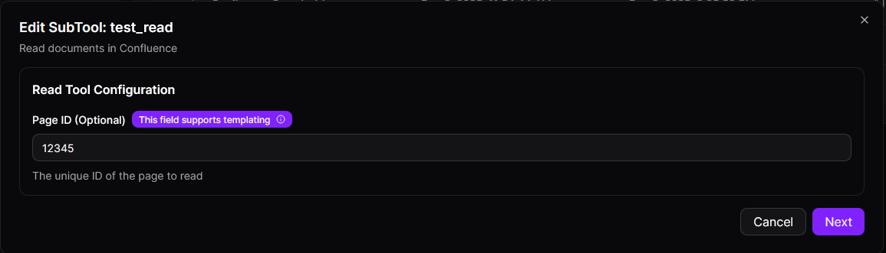
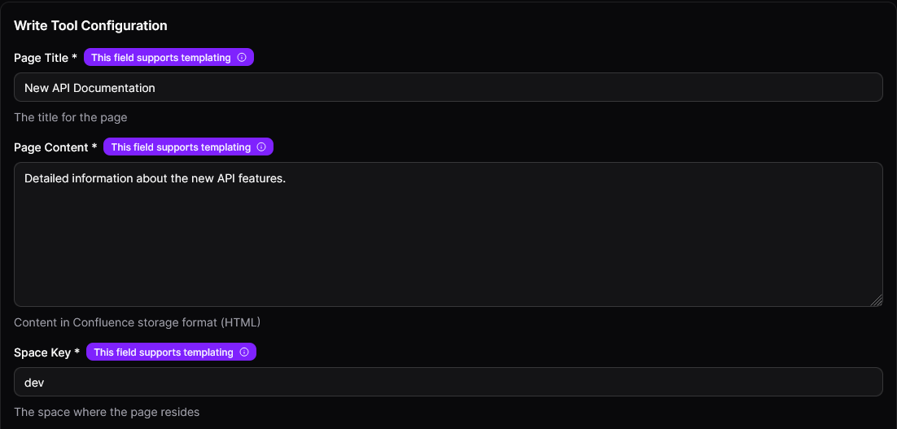
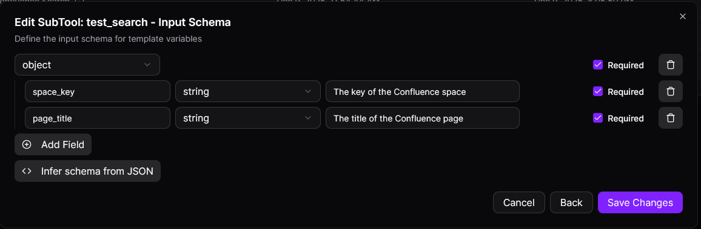
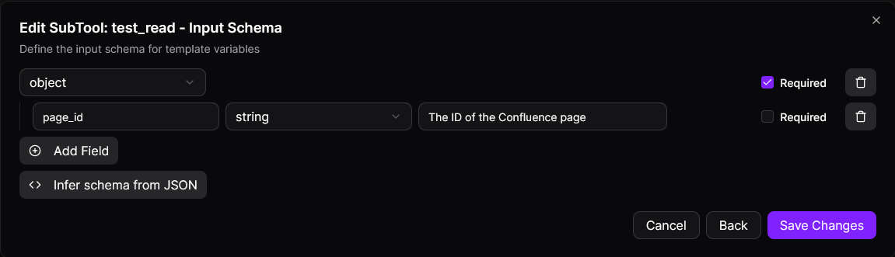
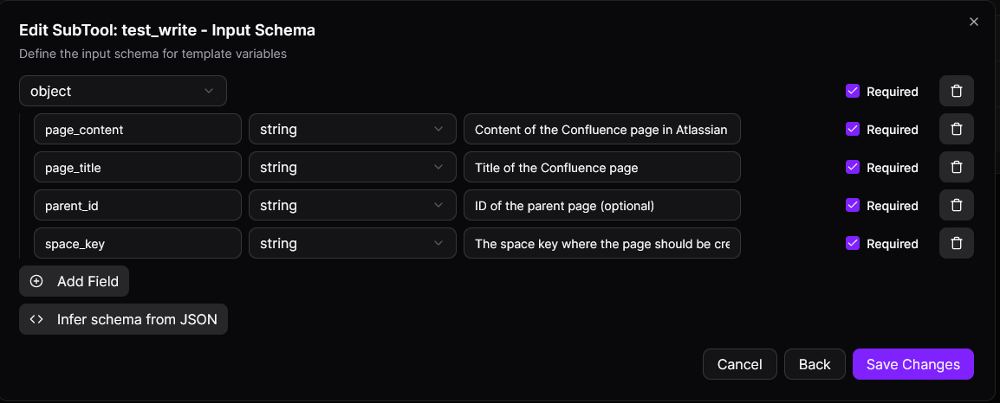

The **Confluence Tool** integrates with Confluence, a collaboration software developed by Atlassian, allowing you to automate workflows, search for pages, read content, and create or update pages directly from the MCP-Express platform. This integration enhances productivity by streamlining interactions with Confluence content and automating content management.

## Configuration

### Connection Parameters

| Parameter      | Required | Description                                                                                                                                        |
| -------------- | -------- | -------------------------------------------------------------------------------------------------------------------------------------------------- |
| `search_query` | Yes      | The search query used to find content in Confluence using Confluence Query Language (CQL). CQL allows filtering and sorting by content properties. |
| `limit`        | Yes      | The maximum number of results to return in the search.                                                                                             |
| `page_id`      | Yes      | The ID of the Confluence page to read.                                                                                                             |
| `space_key`    | Yes      | The key of the space where the page will be created or updated.                                                                                    |
| `parent_id`    | Yes      | The ID of the parent page if the page is nested.                                                                                                   |
| `page_title`   | Yes      | The title of the page to create or update.                                                                                                         |
| `page_content` | Yes      | The content of the page to create or update.                                                                                                       |

### Setting Up Confluence Tool Integration

1. **Select Confluence Tool Integration**:
   In your MCP server dashboard, choose "Confluence" from the available integrations.

2. **Authenticate**:
   Click the "Connect Confluence" button to authenticate the app using **OAuth 2.0**. You will be redirected to Confluence for the authorization process.

3. **Configure Parameters**:
   Set up the configuration for each subtool (Search, Read, Write) by providing the necessary parameters (e.g., `search_query`, `page_id`, `space_key`).

4. **Test Tool**: Use the built-in **Test Tool** to simulate and verify the integration's functionality with Confluence, ensuring that all actions (search, read, write) are working as expected.

## OAuth Integration

The Confluence Tool uses **OAuth 2.0** for secure authentication, allowing seamless integration with Confluence without requiring you to manually enter credentials.

### Authentication Process

- **Click the "Authenticate" Button**:
  In the MCP-Express app, click the "Connect Confluence" button to start the authentication process.

- **Grant Permissions**:
  You will be redirected to Confluence, where you need to grant the app permission to access your Confluence data. This is a one-time process.

- **Automatic Authentication**:
  Once authenticated, the tool will handle the connection automatically, so you don’t have to manually enter any credentials.



## Subtools

### Search Tool

The **Search Tool** allows you to search for Confluence pages based on a query.

**Configuration Parameters**:

| Parameter      | Description                                                                               |
| -------------- | ----------------------------------------------------------------------------------------- |
| `search_query` | The search query using Confluence Query Language (CQL) for filtering and sorting content. |
| `limit`        | The maximum number of results to return.                                                  |

**Example Usage**:

- Search for pages containing the word "API":

  ```
  type:page AND title:"API"
  ```

  

### Read Tool

The **Read Tool** allows you to retrieve the content of a specific Confluence page.

**Configuration Parameters**:

| Parameter | Description                            |
| --------- | -------------------------------------- |
| `page_id` | The ID of the Confluence page to read. |

**Example Usage**:

- Read the content of page with ID `12345`:

  ```
  Read the content of page with ID: 12345
  ```

  

### Write Tool

The **Write Tool** allows you to create or update pages in Confluence.

**Configuration Parameters**:

| Parameter      | Description                                                     |
| -------------- | --------------------------------------------------------------- |
| `space_key`    | The key of the space where the page will be created or updated. |
| `parent_id`    | The ID of the parent page if the page is nested.                |
| `page_title`   | The title of the page to create or update.                      |
| `page_content` | The content of the page to create or update.                    |

**Example Usage**:

- Create or update a page titled "New API Documentation":

  ```
  space_key: "dev"
  page_title: "New API Documentation"
  page_content: "Detailed information about the new API features."
  ```

  

## Templates for Dynamic Values

Confluence Tool allows you to use **dynamic values** in your queries to tailor the behavior of the tool based on user input. Dynamic values are enclosed in double curly braces: `{{ variable_name }}`.

### Dynamic Values in Queries

You can create dynamic search queries, content, and titles that adapt to user input. This allows for more flexibility, as it enables the tool to respond to different inputs rather than using static, hardcoded values.

### Search Tool Example

For the **Search Tool**, dynamic values allow you to build a flexible search query based on user input.

**Example**:

```
type:page AND title:"{{page_title}}"
```


Here:

- `{{page_title}}` is a dynamic value that will be replaced with the title the user provides when they perform the search. This makes the query adaptable to different search terms.

Another example:

```
type:page AND space:"{{space_key}}" AND title:"{{page_title}}"
```



Here:

- `{{space_key}}` will be replaced by the space key the user provides.
- `{{page_title}}` will be replaced with the title the user inputs for the search.

### Read Tool Example

For the **Read Tool**, dynamic values are used to retrieve content from specific pages.

**Example**:

```
"{{page_id}}"
```



Here:

- `{{page_id}}` will be replaced by the ID of the Confluence page that the user specifies when they want to read the page content.

### Write Tool Example

The **Write Tool** uses dynamic values for creating or updating pages in Confluence. This can include the space, title, and content for the page.

**Example**:

Here:

```
space_key: "{{space_key}}"
parent_id: "{{parent_id}}"
page_title: "{{page_title}}"
page_content: "{{page_content}}"
```

Here:

- `{{space_key}}` will be replaced by the space the user selects or provides.
- `{{page_title}}` will be replaced by the title the user provides for the page.
- `{{page_content}}` will be replaced with the content the user inputs for the page.
- `{{parent_id}}` will be replaced with the parent page's ID if the page is being nested under another page.



For example, if a user wants to create a page with the title "API Documentation" in the "dev" space, the tool will dynamically insert those values into the configuration.

By using dynamic values, you can make the tool's behavior more responsive to the user's needs, offering greater flexibility when working with Confluence data.

## Security Features

### Secure OAuth Integration

The Confluence Tool uses **OAuth 2.0** for secure authentication, eliminating the need for manual credentials.

**Best practices**:

- Always use OAuth for secure token management.
- Ensure tokens are stored securely and never exposed to unauthorized users.
- Regularly monitor the status of OAuth tokens to ensure they remain valid.

## Common Use Cases

### 1. Content Search

- **Search** for specific pages in Confluence based on page title, content type, or other criteria.

### 2. Read Content

- **Read** the content of a specific Confluence page using its page ID.

### 3. Create and Update Pages

- **Create** new pages or **update** existing pages with dynamic content, titles, and metadata.

## Best Practices

### Security

- **Use OAuth 2.0** for secure authentication and avoid managing raw credentials.
- **Set minimal permissions** for OAuth applications to ensure least privilege access.

### Performance

- **Limit the results** in search queries to avoid fetching excessive data using the `limit` parameter.
- Regularly test and **optimize your queries** to ensure optimal performance.

### Reliability

- **Monitor token expiration** and set up automatic refresh mechanisms to prevent service disruptions.
- Implement **error handling** for network issues or invalid API responses.

## Troubleshooting

### Authentication Issues

- Ensure that the OAuth authentication process was completed successfully.
- If authentication fails, try re-authenticating by clicking the "Authenticate" button again.

### Search Tool Issues

- If no results are returned, double-check the **search query syntax**.
- Ensure that the **limit** parameter is set appropriately to prevent overly broad queries.

### Read/Write Tool Issues

- If you cannot read or write a page, verify the **page ID** or **space key**, and ensure you have the required permissions to access or modify the page.
- If content isn’t updating as expected, check the **API response** for any errors or warnings.
