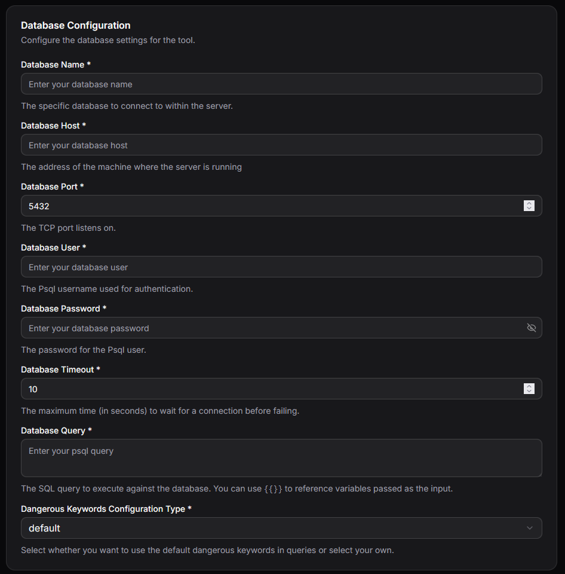
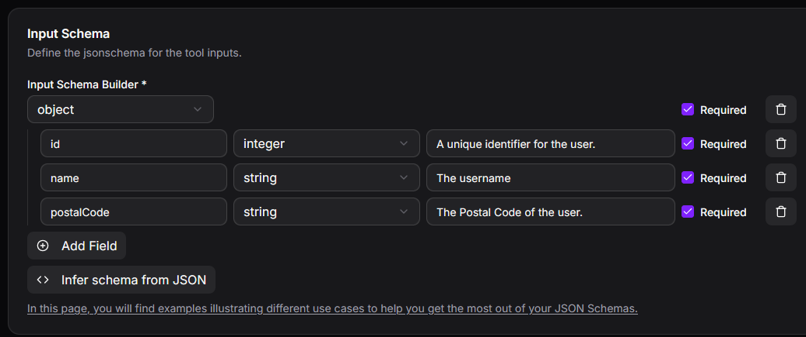
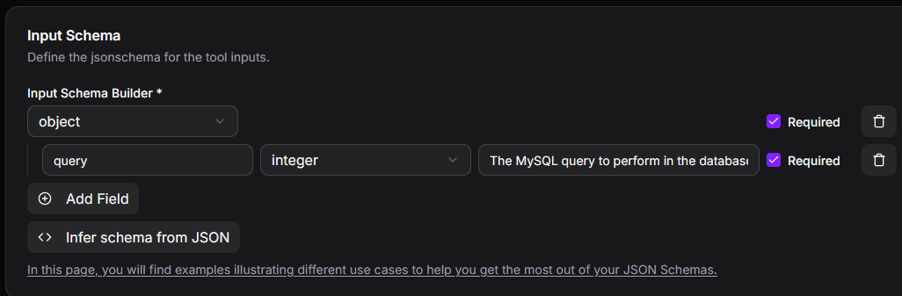

# MySQL Integration

Integrate MCP Express with MySQL databases to create tools that can query and interact with your data. This integration allows you to execute SQL queries against your MySQL database and use the results in your MCP tools.

## Configuration

### Connection Parameters

| Parameter          | Required | Description                                                      |
| ------------------ | -------- | ---------------------------------------------------------------- |
| host               | Yes      | IP address or URL of the MySQL server                            |
| database           | Yes      | Name of the database to connect to                               |
| user               | Yes      | Username for authentication                                      |
| password           | Yes      | Password for authentication                                      |
| Query              | Yes      | SQL query template for dynamic input using variable placeholders |
| Port               | No       | Database port (defaults to 3306)                                 |
| Timeout            | No       | Connection timeout in seconds (defaults to 10)                   |
| Dangerous Keywords | No       | List of SQL keywords to block for security purposes              |

### Setting Up MySQL Integration

1. **Select MySQL Integration**: In your MCP server dashboard, choose "MySQL" from the available integrations
2. **Configure Connection**: Enter your database host, database name, username, and password
3. **Set Port and Timeout**: Optionally customize the port (default: 3306) and connection timeout (default: 10 seconds)
4. **Define Query Template**: Create your SQL query using variable placeholders to accept dynamic inputs
5. **Configure Security**: Add any SQL keywords to block via the Dangerous Keywords list
6. **Test Connection**: Use the built-in connection test to verify your setup works correctly



## Query Templates

The MySQL integration uses templating to create dynamic SQL queries based on tool inputs. This allows you to safely parameterize your queries while maintaining flexibility.

### Template Syntax

Variables from tool inputs can be referenced using `{{ variable_name }}` syntax:

Example:

```sql
SELECT * from users where id={{userId}}
```

### Example Usages

For all examples below, we assume the tool accepts the following input parameters:



#### Static Queries (No Input Parameters Required)

The MySQL integration can execute fixed SQL queries, useful for performing predefined tasks. For example, counting the number of users living in postal code 71250:

```sql
SELECT COUNT(*) as user_count
FROM users
WHERE postalCode='71250'
```

#### Dynamic Template Queries

The MySQL integration supports parameterized queries that accept user input. For example, counting users in a postal code specified by the user:

```sql
SELECT COUNT(*) as user_count
FROM users
WHERE postalCode='{{postalCode}}'
```

### Complete Query from LLM (Requires Special Attention)

The MySQL integration can accept complete SQL queries generated by the LLM. **Important:** Carefully evaluate all security risks, as the LLM may generate incorrect or potentially harmful queries based on user input.

For this scenario, configure the input as follows:



The input query is then forwarded directly to the integration:

```sql
{{query}}
```

## Security Features

### Dangerous Keywords Blocking

The **Dangerous Keywords** parameter enables you to specify SQL keywords that will be blocked in queries, helping prevent potentially harmful operations:

**Common keywords to block:**

- DROP
- DELETE
- TRUNCATE
- ALTER
- CREATE
- GRANT
- REVOKE

### Best Practices for Query Templates

- Use parameterized queries with variable placeholders rather than string concatenation
- Validate and sanitize all user inputs before they reach the query template
- Limit database user permissions to only what's necessary for the tool's function
- Use read-only database users when tools only need to retrieve data

## Common Use Cases

### 1. Data Retrieval

Query data from your MySQL database:

- Fetch customer information by ID
- Retrieve product catalog data
- Search records based on criteria
- Generate reports from stored data

### 2. Data Analysis

Perform analytical queries:

- Calculate aggregates and statistics
- Join multiple tables for comprehensive reports
- Execute complex analytical queries
- Generate business intelligence insights

### 3. Data Updates

Modify data in your database:

- Update customer records
- Insert new entries
- Modify product information
- Manage application state

## Best Practices

### Security

- Use strong passwords and secure credential storage
- Create database users with minimal required permissions
- Always use the Dangerous Keywords list to block destructive operations
- Never expose raw database credentials in tool configurations
- Use SSL/TLS connections when connecting to remote databases

### Performance

- Optimize your query templates for efficiency
- Use appropriate indexes on frequently queried columns
- Set reasonable connection timeouts to prevent hanging connections
- Consider connection pooling for high-traffic scenarios
- Limit result set sizes to prevent memory issues

### Reliability

- Test all query templates thoroughly before deployment
- Implement proper error handling for connection failures
- Monitor query execution times and optimize slow queries
- Have backup and recovery plans for database operations
- Use transactions for operations that modify data

## Troubleshooting

### Connection Issues

- Verify the host, port, and database name are correct
- Check that the database user has proper permissions
- Ensure the MySQL server is running and accessible
- Verify firewall rules allow connections on the specified port
- Check if the connection timeout is sufficient for your network

### Authentication Problems

- Confirm the username and password are correct
- Verify the database user has been created with appropriate privileges
- Ensure the password has not expired or been changed

### Query Execution Issues

- Review the query template syntax for formatting errors
- Verify all template variables are provided by the tool input
- Check if Dangerous Keywords are inadvertently blocking legitimate operations
- Examine MySQL error logs for detailed diagnostic information
- Ensure the database user has sufficient permissions for all operations in the query
