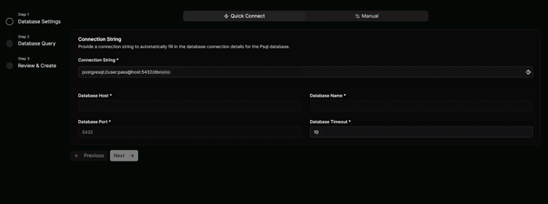
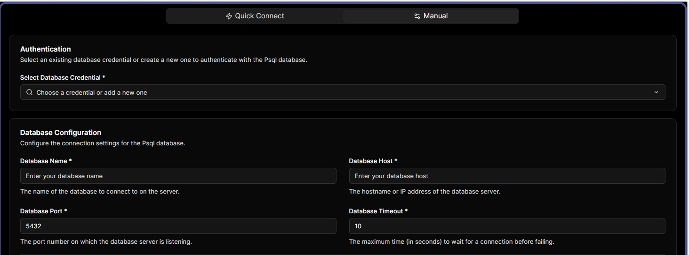
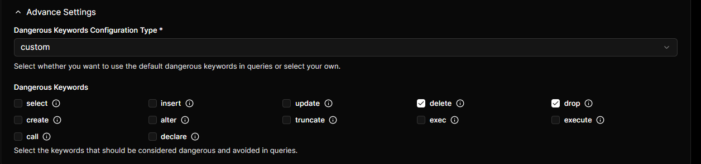

# Configure PostgreSQL Database

Choose between two configuration methods: Quick Connect or Manual.

<!-- tabs:start -->

#### **Quick Connect**

**Quick Connect** simplifies the setup process by automatically populating all necessary connection details. Simply enter your PostgreSQL Connection String, and the system will configure the remaining fields.

#### **Manual Configuration**

**Manual configuration** requires you to enter the following database connection details:

- **Database Credentials** – Your PostgreSQL username and password for authentication
- **Database Name** – The specific database you want to query (e.g., analytics_db)
- **Database Host** – Server address where your database runs (e.g., db.example.com or 192.168.1.100)
- **Database Port** – Connection port, typically 5432 for PostgreSQL
- **Database Timeout** – How long to wait before canceling a connection attempt (in seconds); recommended 10-30 for most cases

#### Advanced Settings

Under Advanced Settings, you can configure dangerous keyword restrictions to prevent potentially harmful operations. These restrictions are enabled by default to protect your database.

In default option, the following dangerous keywords are blocked:
- INSERT
- UPDATE
- DELETE
- DROP
- CREATE
- ALTER
- TRUNCATE
- EXEC
- EXECUTE
- CALL
- DECLARE

If you want to allow dangerous keywords, simply select on the box of the keyword and you're good to go!

<!-- tabs:end -->

#
