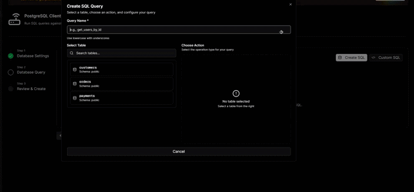
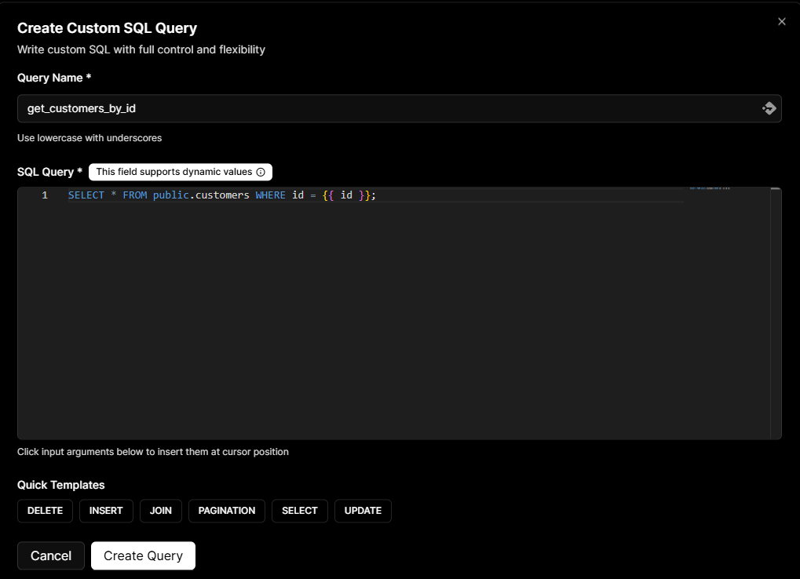
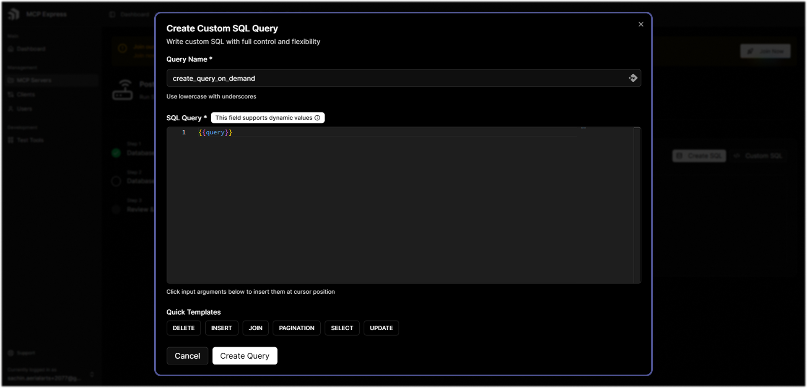

# Query Creator

This section allows you to specify which queries your AI assistant can execute on your database.

import Tabs from '@theme/Tabs'
import TabItem from '@theme/TabItem'

<Tabs>
  <TabItem value='create-sql' label='Create SQL' default>
    The Create SQL interface provides a guided approach for users without SQL expertise:

    

    - Select tables from your synced database
    - Choose from pre-defined common queries
    - Specify columns to include
    - No manual SQL writing required

  </TabItem>
  <TabItem value='custom-sql' label='Custom SQL'>
   Custom SQL lets you write your own queries for advanced and complex use cases.

    ### Dynamic Query & Input Arguments

    Custom SQL supports dynamic queries, meaning the same saved query can return different results depending on the values passed in at runtime. Instead of writing a separate query for every possible scenario, you write one query with `{{argument_name}}` placeholders and let the caller supply the values each time it runs.

    

    This is useful when you need to look up data for a specific user, filter by a date range, or scope results to a particular category without hardcoding those values into the query itself.

    ### How to Define and Place Arguments

    Place an argument in your SQL that accepts a value — for example: in a `WHERE` clause, a `LIMIT`, an `ORDER BY`, or anywhere else a literal value would go.

    A simple query scoped to a single user:
    ```sql
    SELECT * FROM orders WHERE user_id = {{user_id}}
    ```

    A query filtered by date range and status:
    ```sql
    SELECT order_id, product, amount, created_at
    FROM orders
    WHERE user_id = {{user_id}}
    AND status = {{status}}
    AND created_at >= {{start_date}}
    AND created_at <= {{end_date}}
    ORDER BY created_at DESC
    ```

    When this runs, `{{user_id}}`, `{{status}}`, `{{start_date}}`, and `{{end_date}}` are each replaced with the values supplied at runtime — for example: `42`, `'completed'`, `2024-01-01`, and `2024-12-31`.

    You can include as many arguments as your query needs.

    ### Allow AI Dynamically Generate Queries
    The special `{{query}}` argument lets your AI assistant write and execute SQL dynamically based on natural language prompts. Instead of a fixed query with static placeholders, the entire SQL statement is generated at runtime by the AI based on the user's request.

    


    For example, if you ask *"Show me the top 5 customers by revenue this month"* and you have not set up the necessary query, the AI constructs and runs an appropriate SQL query against your database automatically — no predefined query structure required.

    This unlocks flexibility as AI can answer a wide range of data questions without you needing to define each query in advance.

    :::danger
    While you can use `{{query}}` to enable AI assistants to generate SQL queries dynamically from prompts, this approach is strongly discouraged due to potential security risks and malicious behavior. Only use this feature if you have properly configured dangerous keyword restrictions and understand the associated risks.
    :::

  </TabItem>
</Tabs>
