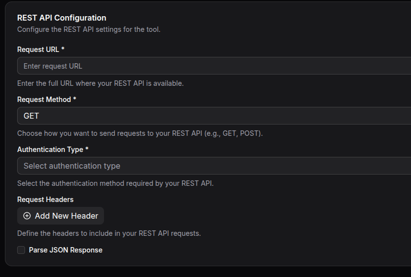

# REST API Integration

Connect your MCP server to RESTful web services to create tools that can interact with external APIs. This integration allows you to make HTTP requests to any REST API and use the responses in your MCP tools.

## Configuration

### Connection Parameters

| Parameter | Required | Description |
|-----------|----------|-------------|
| URL | Yes | The complete URL endpoint you want to call |
| HTTP Method | Yes | GET, POST, PUT, or DELETE |
| Headers | No | Custom headers to include with requests |
| Authentication | No | Choose from available authentication methods |
| Parse JSON Response | No | Whether to automatically parse JSON responses |

### Setting Up REST API Integration

1. **Select REST API Integration**: In your MCP server dashboard, choose "REST API" from the available integrations
2. **Configure Connection**: Enter the API endpoint URL and select the HTTP method
3. **Set Authentication**: Choose and configure your authentication method if required
4. **Add Headers**: Include any custom headers your API requires
5. **Test Connection**: Use the built-in connection test to verify your setup works correctly

*Example of REST API integration setup with Bearer Token authentication*

## Authentication Methods

### No Authentication
For public APIs that don't require any credentials.

### HTTP Basic Authentication
Use username and password authentication for APIs that support HTTP Basic Auth.

**Required Fields:**
- Username: Your API username
- Password: Your API password

### Token-Based Authentication
Use bearer tokens or API keys for token-based authentication systems.

**Required Fields:**
- Token: Your authentication token or API key
- Token Type: Usually "Bearer" but can be customized for specific APIs

### OAuth Client Credentials Flow
For APIs that use OAuth 2.0 Client Credentials authentication flow.

**Required Fields:**
- Client ID: Your OAuth application client ID
- Client Secret: Your OAuth application client secret
- Token URL: The OAuth token endpoint URL
- Scope: The access scope to request (optional)

## HTTP Methods

Choose the appropriate HTTP method based on what you want to accomplish:

- **GET**: Retrieve data from the API (most common for reading information)
- **POST**: Create new resources or submit data
- **PUT**: Update existing resources completely
- **DELETE**: Remove resources

## Headers Configuration

Add custom headers that your API requires. Common examples include:
- Content-Type headers for specific data formats
- API version headers
- Custom authorization headers
- User-Agent headers

Headers support dynamic values using your tool's input parameters, allowing you to customize requests based on user input.

## Response Handling

### JSON Parsing
Enable "Parse JSON Response" to automatically convert JSON responses into structured data that can be easily used in your tools. When disabled, responses are returned as raw text.

### Error Handling
The integration automatically handles common HTTP status codes:
- **200-299**: Success responses are returned normally
- **400-499**: Client errors are reported with details about what went wrong
- **500-599**: Server errors are handled gracefully with retry logic

## Common Use Cases

### 1. Data Retrieval
Fetch information from external services like:
- Weather data from weather APIs
- Stock prices from financial APIs
- User information from CRM systems

### 2. Data Submission
Send data to external services:
- Submit form data to third-party services
- Create records in external systems
- Send notifications via messaging APIs

### 3. Content Management
Manage content in external systems:
- Update product information in e-commerce platforms
- Modify user profiles in external databases
- Synchronize data between systems

## Best Practices

### Security
- Always use HTTPS endpoints when possible
- Store sensitive credentials securely using the authentication configuration
- Never include sensitive information directly in URLs or headers

### Performance
- Use appropriate HTTP methods for different operations
- Consider caching strategies for frequently accessed data
- Implement proper error handling for failed requests

### Reliability
- Test your API connections thoroughly before deploying
- Monitor API usage to stay within rate limits
- Have fallback plans for when external APIs are unavailable

## Troubleshooting

### Authentication Issues
- Verify your credentials are correct and haven't expired
- Check that you're using the correct authentication method
- Ensure token types and formats match API requirements

### Connection Problems
- Verify the API URL is correct and accessible
- Check that the API endpoint supports your chosen HTTP method
- Ensure any required headers are properly configured

### Response Issues
- Check if JSON parsing should be enabled or disabled
- Verify the API is returning data in the expected format
- Review API documentation for correct request structure