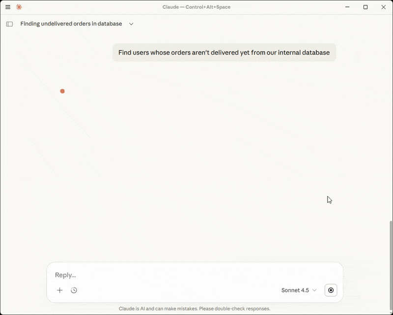

# Quick Start Guide

Get your first MCP server up and running in 5 minutes!
## Prerequisites

- **MCP Express Account** – [Sign up free](https://app.mcp-express.com/signup) - no credit card required
- **MCP-Compatible AI** – Example: [Claude Desktop](https://code.claude.com/docs/en/desktop)
- [**Node.js**](https://nodejs.org/en/download) – Verify your environment by running `node --version`
- **PostgreSQL database** – Ensure you have your connection string accessible.

**Time required:** 5 minutes

> [!TIP|label:What is MCP]
> **MCP (Model Context Protocol)** is an open standard that lets MCP-compatible AI models like ChatGPT, Claude, Github Copilot, etc. connect to external data sources, tools, and services.  
> [Learn More: Model Context Protocol](https://modelcontextprotocol.io)

---

## Create your First Tool

1. **Create a Server**: Select the `+ New MCP Server` button in your dashboard header. Enter a name and description to ensure clear resource mapping across your infrastructure.
1. **Add Tool**: Within your new server view, select `Add Tool` to begin extending your agent's capabilities.
1. **Select Integration**: Choose `PostgreSQL` from the integration library.
1. **Quick Connect**: Paste your PostgreSQL connection string. We will automatically populate the configuration parameters for you.
1. **Define Operations**: [Insert the SQL queries](https://docs.mcp-express.com/#/integrations/postgresql/query-editor) you want your AI agent to execute.
1. **Metadata Assignment**: Provide a precise name and description for the tool. You will empower your AI agent to intelligently determine when to invoke this operation during a live session.

> For more details, see the [PostgreSQL documentation](https://docs.mcp-express.com/#/integrations/postgresql).

---

## Connect Your AI Agent

1. **Provision a Client**: Create a new client within the dashboard.
1. **Query your Data**: You'll now be able to interact with your PostgreSQL instance using natural language, eliminating the need for manual context-switching.

  

   See detailed articles on how to work with your AI Agent:
   - [Connect Claude with your MCP Server (Detailed Article)](https://www.mcp-express.com/blogs/create-and-connect-mcp-server-with-claude-under-5-minutes/)

:1st_place_medal: **Congratulations!** You have successfully democratized your database access.

**Try these prompts to test your new flow state:**
- `"Analyze the schema of my connected database."`
- `"What is the …?"` – to explore your data  

> Note on Governance: Your AI Agent operates within the specific access parameters you configured. If an operation is restricted, you will receive a permission error to ensure data integrity.
<!-- > Refer to our documentation on [how to control your access](#). -->

---

## Next Steps

- **Scale your operations** – Add complex queries for fetching orders or updating records.
- **Expand your ecosystem** – Integrate Slack or Confluence to centralize your strategic insights.
- **Enable your team** – Invite colleagues so **they will** benefit from the same high-context AI tools.

---

## Need Help?

### Troubleshooting your Tools

1. Go to **Test Tools**.
2. Select your server: `my-postgres-server`
3. Choose tool: `get_users_by_id`
4. Run your tool to find issues

### Other Resources

- 📖 [Full PostgreSQL Documentation](https://docs.mcp-express.com/#/integrations/postgresql)
- 📧 [Talk With Us](mailto:service@elephanti-soft.de)